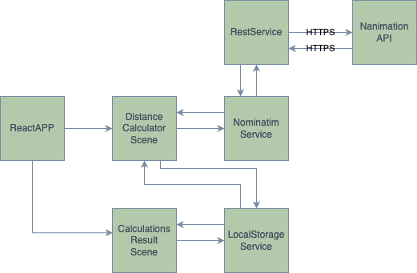
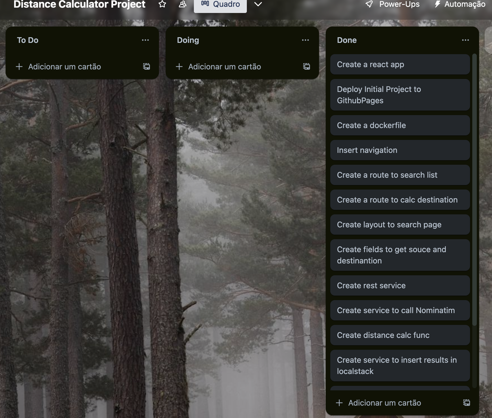

# [Distance Calculator](https://mikhaelle.github.io/distance_calculator/)

1. Tell us what pieces of software you think are necessary to develop for the working
   prototype and how they are related. We call each application (web, mobile or desktop),
   each API, each batch process that can be deployed independently a piece of software.
   Support yourself with a diagram if you think necessary.
   

   Based on my MVP idea, for develop a functional prototype it will be necessary a Web Application, 
   an API Requests, a storage and a deploy place.  
   
   A React.js framework with the javascript language, support tree of these points. 
   As a web application it offers a component-based approach for building responsible web interfaces. 
   It is also possible to interact with the Nonimation API, using axios. Axios enable sending HTTP requests 
   and retrieve data from API. For the storage, the framework provide a browser`s local storage feature called
   Local Storage that made possible storage and retrieve the distance search information. 
   The entire flow can be found in the next picture.
   
   For the deploy, It was chosen to use the Github pages, because is free and easy to deploy.   
   

2. Tell us about the type of architecture you chose for question (1). Monolithic?
   Micro-services? Any intermediate? Other? Comment on what you based to make this
   decision.

   In this project I choose to use a monolithic web application with the React.js framework 
   because they are relative more simple to develop and deploy, and all the components can communicate
   directly with each other. Also, some of the resources can be share entire the application, and the React.js 
   framework has the component-based approach that allows to share and reuse components, what improve the 
   code reuse and simplified maintenance. In this project case, it was easier to have only one application 
   to deploy.
   On the other hand, a monolithic may have problems in scale horizontally or development velocity in large applications 
   what was not the case of this project.

3. Describe the work methodology you would use for development. It can be some
   known methodology (Scrum, XP, RUP), an adaptation, or a mixture between several
   methodologies. Whatever your experience has shown you works. Tell us why you think this
   form is appropriate for our problem.

   I decided to use Kanban because of the flexibility, adaptability and easy way to visualize 
   workflow. The methodology consist in tree steps, tasks "To Do", tasks "Doing" and tasks "Done". It is good
   to limit the number of tasks in progress and focus on finish them before start a new task. It is also a good 
   way to prioritize and reorganize tasks. The tasks were small changes to be implemented in a continuous delivery way.
   It is possible to see how was the kanban at the end of the project in the next image, , the tasks are in ascending order of execution.

4. Describe the workflow you would use to collaborate using Git. As with (3), you can
   use something familiar or an adaptation.

   I decided to use something similar to a trunk-based development, that consist in commit the changes directly 
   to the master branch. It encourages small, incremental changes and continuous integration. A trunk-based 
   development require a robust process of testing and quality assurance, what was not implemented in this solution, 
   because of this, the approach was an adaptation. After the development, in the gh-pages branch is made a rebase with 
   master and run the "yarn predeploy" to build a static executable of the React app and "yarn deploy" to upload the changes 
   to the gh-pages responsible to deploy automatically the application in Github Pages.

5. Do you think it is necessary to add any extra member to the team during the
      development of the prototype? What would your role be? Do you think it would be
      necessary to add new members after the prototype phase? When and why?

   As describe in the challenge the team already have a Dev designer, an Impact Lead, a Software Engineer 
   and a support of a Data Scientist, so I think that one more Software Engineer member could help with the actual proposal solution 
   because of the time limitation, there are still 
   some areas that have possibilities for improvement, like deploy configuration, app configuration, lint and prettier configuration, tests with jest and 
   react-testing-library to configure and create, some validations with fields and handle data, design and quality assurance.
   

6. What other considerations would you have to make the development process robust
and efficient?

   Another suggestion to a more robust architecture, is to separate a client and a server, 
   for example, create a BFF Rest API to handle with the api calls
   and distance calculation, and create a database like MongoDb that will be 
   responsible to handle the search data. It`s also possible to create microservices like one to handle with Nonimation calls
   and another to handle with the data manipulation. 
   Other improve suggest is to make possible to list the correspond search places still when the user
   are typing in the field, what will increase the user experience and reduce possibles wrong error calculation.

# Getting Started with Distance Calculator

This project was bootstrapped with [Create React App](https://github.com/facebook/create-react-app).

The web page can be access in [Distance Calculator]
## Available Scripts

In the project directory, you can run:

### `npm start`

Runs the app in the development mode.\
Open [http://localhost:3000](http://localhost:3000) to view it in your browser.

The page will reload when you make changes.\
You may also see any lint errors in the console.

### `npm run predeploy`

Run this in gh-pages branch

Builds the app for production to the `build` folder.\
It correctly bundles React in production mode and optimizes the build for the best performance.

The build is minified and the filenames include the hashes.\
Your app is ready to be deployed!

### `npm run deploy`

Run this in gh-pages branch after "npm run predeploy" to deploy the application to Github pages

## Running local with docker
In the root folder run `docker build -t distance-calculator .` to build the image 
and after `docker run -p 3000:3000 distance-calculator` to run the app in 3000 port.

